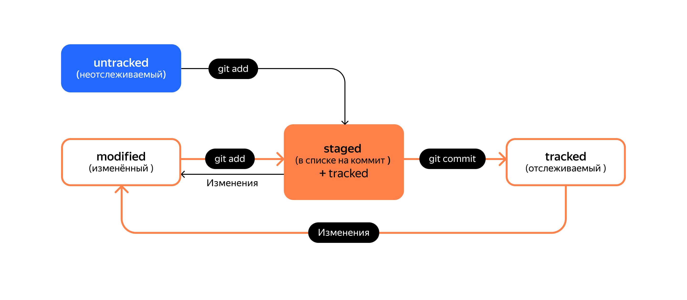

# GIT OVERVIEW

## Installing
1. Install from site
2. Setting global settings
Set name & e-mail

```bash
git config user.email "bob@example.com"
git config user.name "Name Fullname"
```

## Adding SSH key

1. Generate key
2. Adding key
	- adding to github
	- adding to sshagent
3. Verify key

### Generate SSH key

```bash
ssh-keygen -t ed25519 -C <e-mail>
```

Put private key to
~/.ssh/


### Adding to sshagent

```bash
# start the ssh-agent in the background
$ eval "$(ssh-agent -s)"
> Agent pid 59566
```

```bash
ssh-add ~/.ssh/id_ed25519
```

[Ссылка на документацию:](https://docs.github.com/ru/authentication/connecting-to-github-with-ssh/generating-a-new-ssh-key-and-adding-it-to-the-ssh-agent)

## Commands


### Инициализация репозитория

#### Создание пустого репозитория
```bash
git init
```

#### Клонирование репозитария

```bash
git clone
```

#### Убедиться, что репозитории связаны

```bash
git remote -v
```

#### Синхронизация локального и удалённого репозиториев - git remote add

```bash
cd ~/dev/first-project
git remote add origin git@github.com:%ИМЯ_АККАУНТА%/first-project.git
```

```bash
git push -u origin main 
```

В первый раз загрузи все коммиты из локального репозитория в удалённый с названием origin.


## Добавление коммита
1. Добавить файлы в stage-состояние
2. Закоммитить файлы
3. Запушить на удаленный сервер

```bash
git add .
git commit -m "описание коммита"
git push
```


## Просмотр изменений

```bash
git diff
```

- Команда *git diff* сравнит последнюю закоммиченную версию файла с той, что находится в состоянии *modified*.
- Команда *git diff --staged* покажет изменения в staged-файлах относительно последних закоммиченных версий.

```bash
git diff <коммит1> <коммит2>
```
С её помощью удобно сравнивать изменения в двух коммитах.


## Вывод лога

### Получить список коммитов

```bash
git log
```


### Получить сокращённый лог 

```bash
git log --oneline
```

## Статусы файлов в Git


**untracked/tracked**, **staged** и **modified**

- untracked (англ. «неотслеживаемый»)

- staged (англ. «подготовленный»)

 После выполнения команды *git add* файл попадает в staging area (от англ. stage — «сцена», «этап [процесса]» и area — «область»), то есть в список файлов, которые войдут в коммит. В этот момент файл находится в состоянии *staged*.

- tracked (англ. «отслеживаемый»)

Состояние *tracked* — это противоположность *untracked*. Оно довольно широкое по смыслу: в него попадают файлы, которые уже были зафиксированы с помощью *git commit*, а также файлы, которые были добавлены в staging area командой *git add*. То есть все файлы, в которых Git так или иначе отслеживает изменения.

- modified (англ. «изменённый»)

Состояние *modified* означает, что Git сравнил содержимое файла с последней сохранённой версией и нашёл отличия. Например, файл был закоммичен и после этого изменён.


### Типичный жизненный цикл файла в Git




Важное

- Статусом *untracked* помечается файл, о существовании которого Git знает, но не следит за изменениями в нём. Этот статус — противоположность *tracked*, в который попадают все файлы, отслеживаемые Git.
- Файл переходит в статус *staged* после выполнения *git add*.
- Статус *modified* означает, что файл был изменён.
- Большинство файлов в проектах «шагает» по следующему циклу: «изменён» → «добавлен в список на коммит» → «закоммичен» → «изменён» → и так далее.


## Как откатиться назад

### Выполнить unstage изменений

```bash
git restore --staged <file>
```

Чтобы «сбросить» все файлы из *staged* обратно в *untracked/modified*, можно воспользоваться командой *git restore --staged .*: она сбросит всю текущую папку *(.)*.

### «Откатить» коммит

```bash
git reset --hard <commit hash>
```

### «Откатить» изменения, которые не попали ни в staging, ни в коммит

```bash
git restore <file>
```

Резюме:

- Команда *git restore --staged <file>* переведёт файл из *staged* обратно в *modified* или *untracked*.
- Команда *git reset --hard <commit hash>* «откатит» историю до коммита с хешем *<hash>*. Более поздние коммиты потеряются!
- Команда *git restore <file>* «откатит» изменения в файле до последней сохранённой (в коммите или в staging) версии.


## Игнорирование файлов в Git

[Ссылка на материал](/ignoring.md)


## Ветки в Git

[Ссылка на описание](/branches.md)


## Git Diff

[Ссылка на описание](/diff.md)


## Описание Markdown

[Ссылка на описание](/markdown.md)
